# 一、前言

本文主要针对如何使用四路CANFD的HSCanT设备在EcuBus-Pro上位机软件的一些基础使用，方便用户快速使用起来。

对于EcuBus-Pro相关介绍可以查看以下链接：

https://app.whyengineer.com/zh/docs/um/can/can.html

# 二、EcuBus-Pro上位机准备

## （一）软件下载和安装

EcuBus-Pro上位机下载以及安装链接，可从github或者国内CDN进行下载

https://app.whyengineer.com/zh/docs/about/install.html

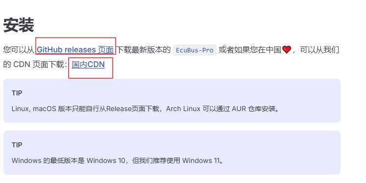

---

---

安装完成后软件界面如下：

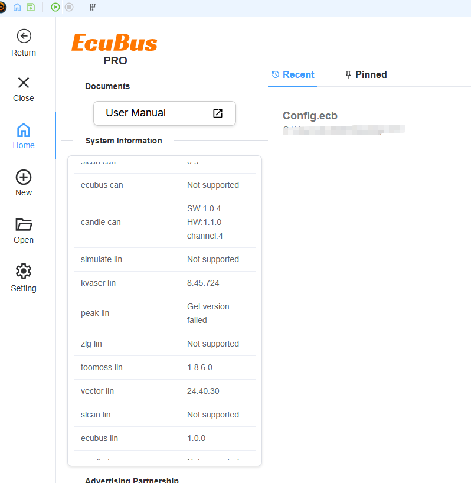

---

如果有软件更新，会在Setting的update窗口提示更新

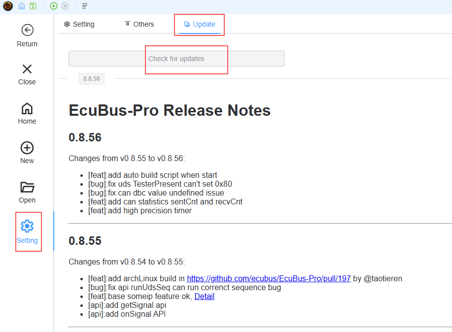

---

# 三、EcuBus-Pro基本使用

## （一）新建空白项目

在New窗口点击新建空白工程Create Empty Project，该工程可以进行保存，然后下次可以重复打开。

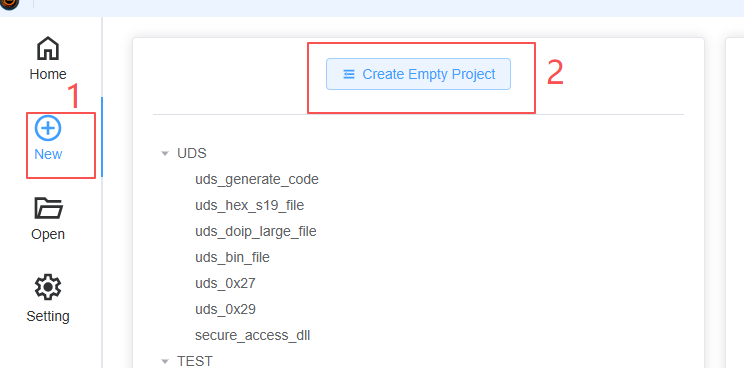

---

## （二）项目添加HSCanT设备

点击任务栏的Hardware，选择Devices，下来选择到CANDLE，点击CAN，搜索Device，即可看到四路或者多路canfd的HSCanT设备。

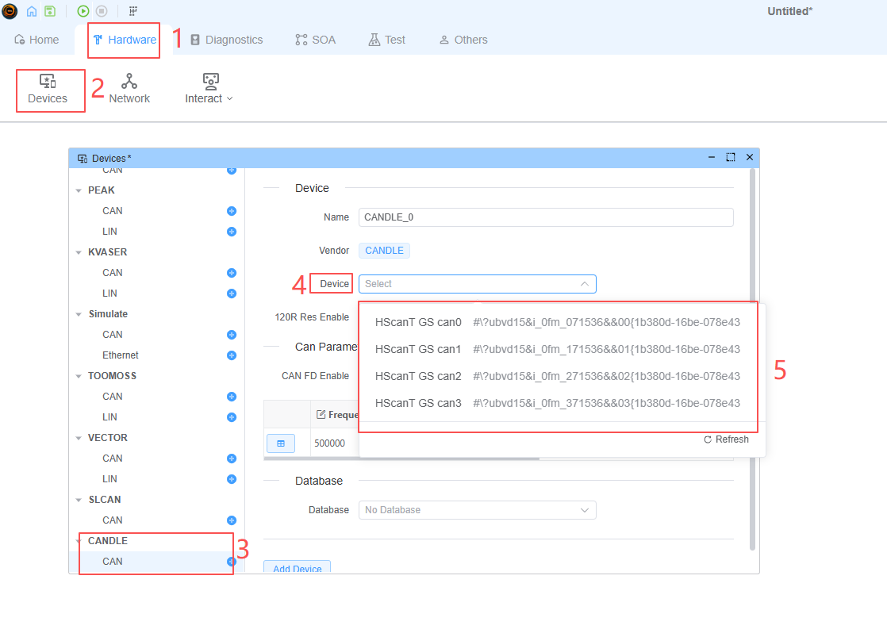

---

这里举个例子：

选择HSCanT GS can0，打开120R匹配电阻，使能CANFD功能，波特率为500K/2M，命名为CANDLE_0，然后点击Add Device。

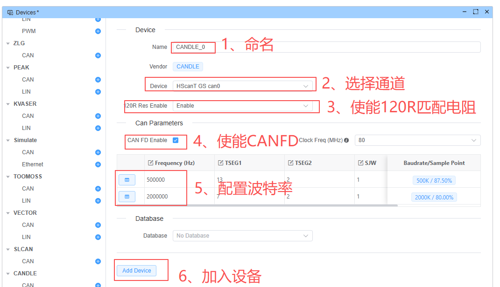

---

这样就可以添加进来了，如果想改变参数，选择完毕后点击Save Device即可。

比如改变CANFD的数据段的波特率为4000000Hz，采样点为80%。

先在Frequency修改数据段的波特率为4000000Hz。

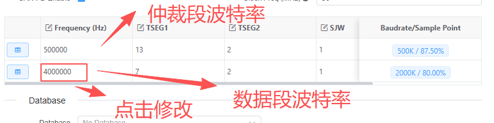

---

点击田框

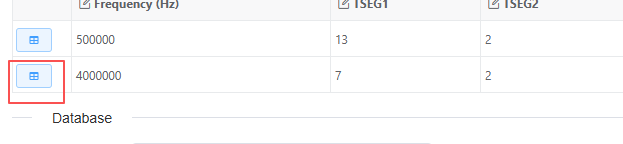

---

选择你想要的timing参数，比如以下的12，进行点击，然后选择OK即可

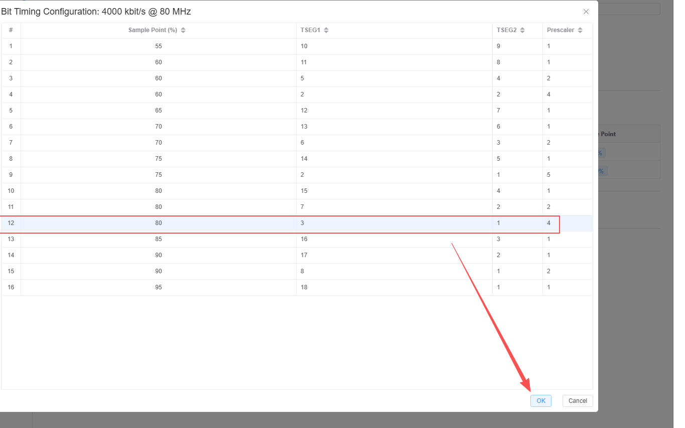

---

如此一来就改变参数了。

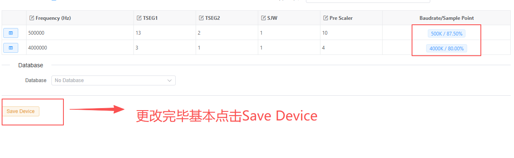

---

## （三）项目添加交互器，管理设备待发送的帧消息

点击Hardware->Network,在窗口中点击Interactive添加一个交互器

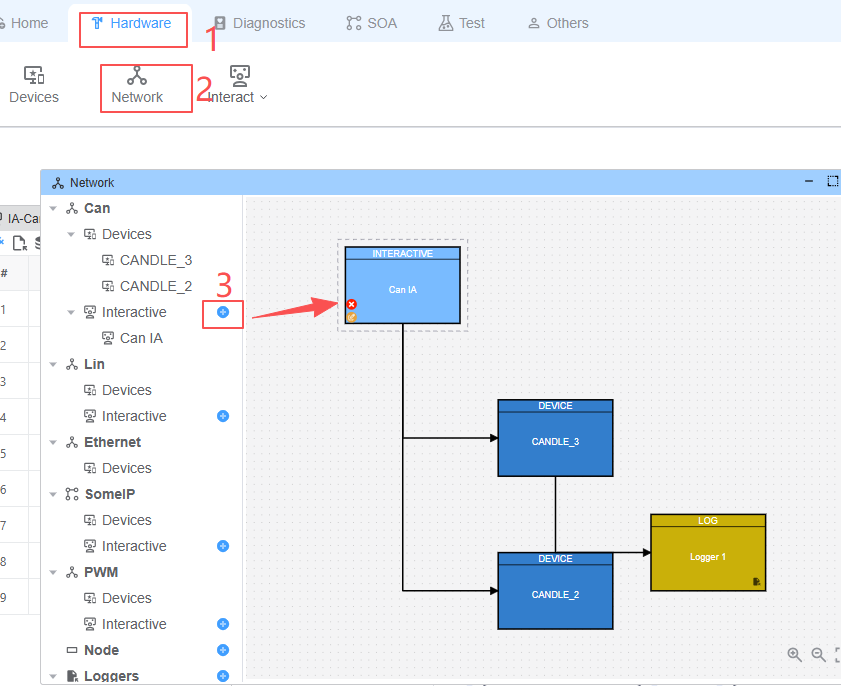

---

点击交互器进行配置链接

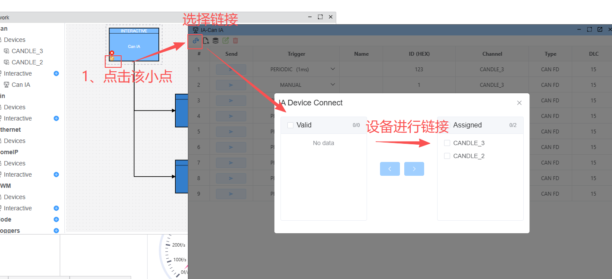

---

完成绑定后，新建发送帧，可以根据需求更改帧大小，帧ID等等。

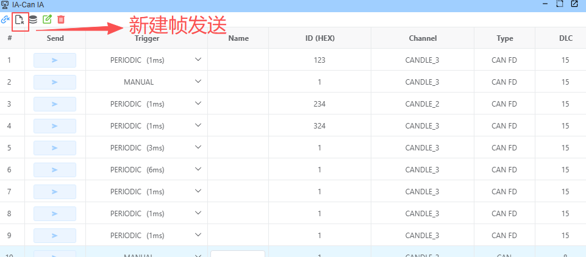

---

## （四）收发测试

点击Start,信息栏提示HSCanT相关软件和硬件版本等信息，还有设备的启动成功

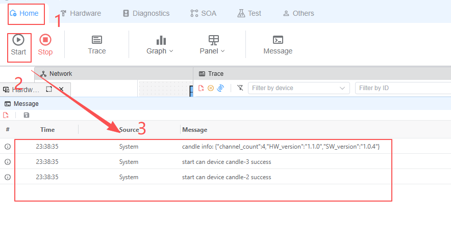

---

打开追踪界面，点击Home->Trace，该串口可以看到CAN总线的报文信息。

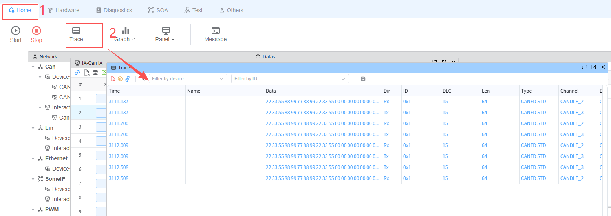

---

每个设备都有自己的系统变量，比如负载率，收发次数，收发频率等等，在Others->Variables可以看到

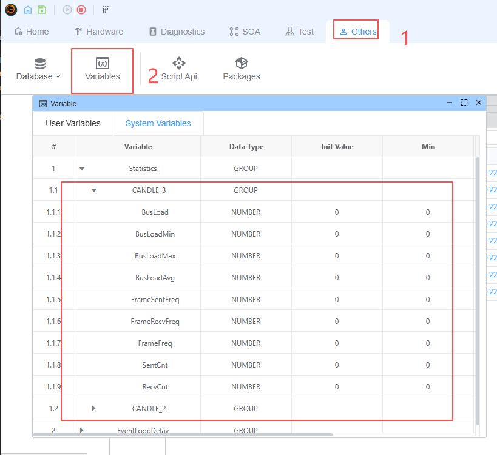

---

可以通过Home->Graph中进行可视化查看，比如Data显示或者仪表显示等等。

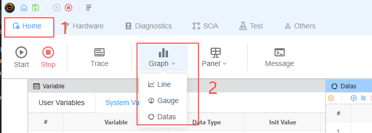

---

比如Datas口显示收发的次数，只需要点击Add Variable即可

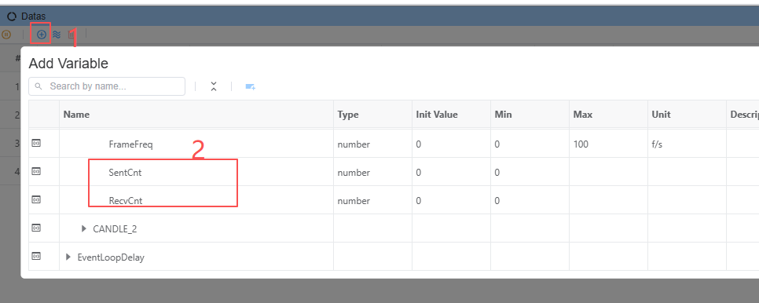

---

当有数据进行收发的时候就会显示次数

需要注意的是：如果要清零次数，得关闭设备再打开设备。

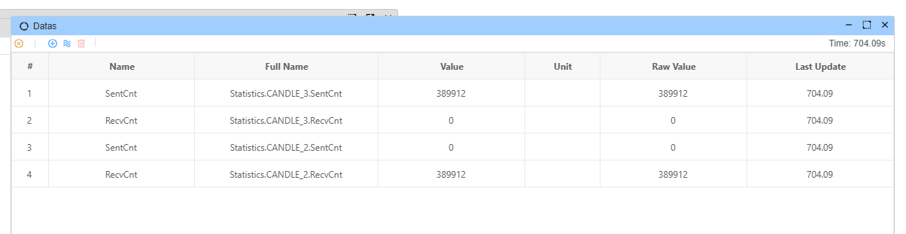

---

如果想直观看总线的负载率等等信息，可以使用Gauge窗口

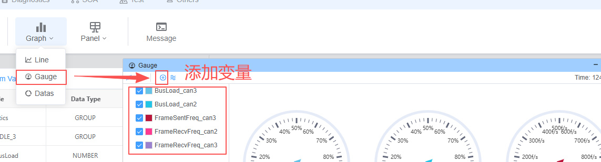

---

如果想进行编辑删除可以右键点击变量

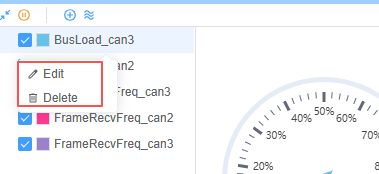

---

当有数据进行收发的时候就会显示变化。

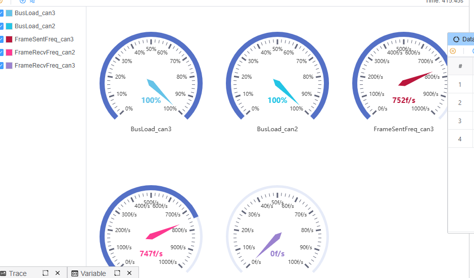

---

